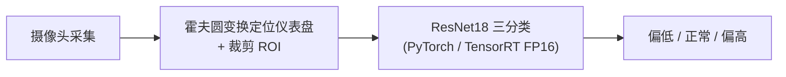
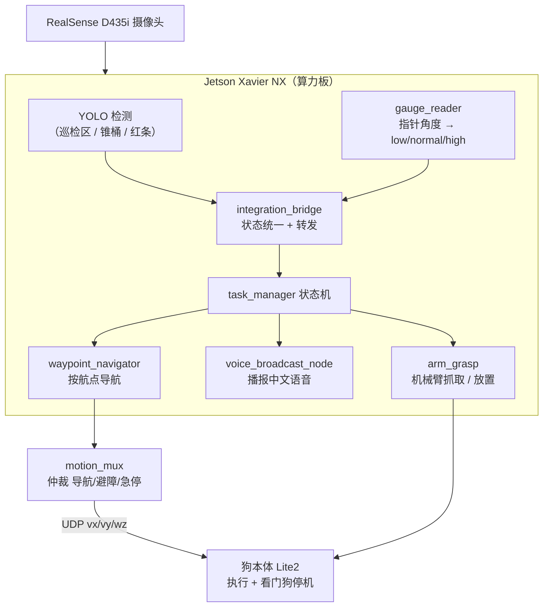
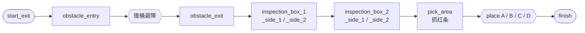

<p align="center">
  
</p>

<h1 align="center">四足机器狗 · 2026 中国高校智能机器人创意大赛（四足大型组）</h1>

<p align="center">
  参赛队伍 <b>Miner</b>（中南民族大学）　·　绝影 Lite2 + Jetson Xavier NX + Intel RealSense D435i + JetArm 六自由度机械臂
</p>

<p align="center">
  <a href="https://github.com/Nanako-Arasaka/dog/stargazers"></a>
  
  
  
  
  
</p>

---

## 目录

- [比赛背景与规则](#比赛背景与规则)
- [两个阶段一览](#两个阶段一览)
- [预选赛（专项赛）](#预选赛专项赛)
- [国赛：最终集成版](#国赛最终集成版)
- [仓库结构](#仓库结构)
- [快速开始](#快速开始)
- [文档索引](#文档索引)
- [当前状态与待办](#当前状态与待办)
- [许可证](#许可证)

---

## 比赛背景与规则

赛项要求机器狗在限定时间内自主完成巡检任务，全程不能人为干预。设备受严格约束（算力 ≤ Jetson Xavier NX、机械臂臂展 ≤ 50 cm / ≤ 6 自由度 / ≤ 2 kg、**禁激光雷达**）。

| 项 | 内容 |
|---|---|
| 国赛任务分值 | 避障 10 分 + 巡检识别 40 分 + 长条抓取 50 分（满分 100） |
| 国赛总分构成 | 线下挑战 60% + 技术报告 40% |
| 巡检播报 | 仪表盘状态 5 分/次 + 区域字母 5 分/次，共 4 次；仅终端输出无语音得分减半 |
| 抓取规则 | 红色长条 = 异常，绿色 = 正常；悬空超 3 s 计成功；掉落每次 -5 分，掉落 3 次结束 |
| 赛制 | 4 分钟测试 + 10 分钟正赛，最多两轮取最好成绩 |

> 技术报告评分：技术方案 40% + 文档呈现 40% + 工程代码 20%（详见 [`国赛/docs/技术文档_草稿.md`](国赛/docs/技术文档_草稿.md)）。

## 两个阶段一览

| 阶段 | 形式 | 核心任务 | 评分重点 | 代码位置 |
|---|---|---|---|---|
| **预选赛（专项赛）** | 线上视频 + 技术报告 | 四大板块：视觉识别（表针+颜色）+ ROS 程序题 + ROS 基础操作 + ROS 建图导航 | 视频呈现 + 报告 | [`NEW Edition/`](NEW%20Edition/)、[`new/`](new/) |
| **国赛** | 线下挑战 + 技术文档 | 避障 → 巡检识别（含语音播报）→ 红条抓取与放置 | 线下 60% + 文档 40% | [`国赛/`](国赛/)（最终集成版） |

---

## 预选赛（专项赛）

足式机器人挑战赛预选赛，线上提交视频（30–120 s）+ 技术报告。考核**四大板块**，全部跑通在绝影 Lite2 上：

| 板块 | 考核内容 | 仓库代码 | 说明 |
|---|---|---|---|
| ① 视觉识别 | 表针三态识别 + 颜色/形状识别 | `NEW Edition/`、`new/` | 霍夫圆定位 + ResNet18 分类；HSV 传统视觉做颜色识别 |
| ② ROS 程序题 | 服务通信、接口设计、代码优化 | — | 详见技术报告 |
| ③ ROS 基础操作 | rosbag 录制再现 turtlesim 轨迹、工作空间覆盖 | — | 详见技术报告 |
| ④ ROS 建图与导航 | 新建/改 Gazebo 环境、小车轨迹写“马”字定点导航 | — | 详见技术报告 |

### ① 视觉识别（本仓库已实现）

**表针识别**：相机 ≥ 1 m 拍摄工业仪表盘，终端中文输出偏低 / 正常 / 偏高（对应黄 / 绿 / 红区）。流程：



- 霍夫圆参数经多轮调优（`param2` 分级搜索、`min_radius` 下限、确认滑窗），压住误检伪圆
- TensorRT FP16 加速，解决机载算力跑不动深度学习的问题
- 中文输出走 PIL 渲染（绕开 Linux 下 OpenCV 中文乱码）

**颜色识别**：图中红 / 绿 / 蓝 / 粉物块（圆盘、小球、正方体、长方体、圆柱），用传统视觉做 HSV 分割 + 形态学清洗 + 分水岭切粘连 + 几何特征分类形状，准确率 95%+。专门处理了红色双区间、粉色归红、物块粘连等坑（形状种类有限，未上深度学习）。

**代码位置**
- [`NEW Edition/`](NEW%20Edition/) — 预选赛最终版
- [`new/`](new/) — 修订版（`start_dog.py` 狗端入口、`start_jetson.py` Jetson/TensorRT 入口、`detect_dashboard_trt.py` / `Dashboard_detec2t.py` 推理、`trans_onnx.py` / `trans_trt.py` 模型转换）

> 模型权重 / TensorRT 引擎通常未入库（见各自目录 `.gitignore`）。细则见 [`NEW Edition/README.md`](NEW%20Edition/README.md) 与 [`new/README.md`](new/README.md)。

### ②③④ ROS 板块（详见技术报告）

ROS 程序题、基础操作、建图与导航三块均以模块化封装实现，完整流程、思路框架与测试结果见 **预选赛技术报告**（`2026中国高校智能机器人创意大赛-四足机器人专项赛-预选赛技术报告.pdf`，不在本仓库快照内）：

- **ROS 程序题**：`service` 服务通信接口设计与代码优化
- **ROS 基础操作**：`rosbag` 录制 / 回放 turtlesim 运动轨迹；ROS 工作空间覆盖（package path 配置）
- **ROS 建图与导航**：新建 Gazebo 环境 → 改造环境 → 小车轨迹写“马”字定点导航

> 这三块的工程代码未随本仓库提交。如需补全，请把对应目录加入仓库（或把技术报告 PDF 一并纳入 `docs/`）。

### 项目创新点（预选赛）

1. 所有赛题整合到四足机器人，跑通“建图 — 导航 — 识别”完整巡检流程
2. 仪表盘识别用“霍夫圆定位 + ResNet18 分类 + TensorRT”兼顾速度与精度
3. 颜色识别全传统视觉，解决 HSV 红色双区间、粉色归红、物块粘连，准确率稳定 95%+
4. ROS 部分模块化封装，便于调试扩展

---

## 国赛：最终集成版

10 分钟自主巡检（避障 → 巡检识别 + 语音播报 → 红条抓取放置）。架构思路：重活全放 Jetson 算力板，狗本体只做两件事——接收速度指令、超时自己停机。

### 系统架构



### 任务流程（FSM）



### 四大模块

| 模块 | 关键文件 | 说明 |
|---|---|---|
| 巡检识别 | `live_detect_yolo_opencv.py`、`gauge_reader.py` | YOLO 定位 A/B/C/D 与仪表盘 ROI → OpenCV 读指针角度 → low/normal/high，多层降级兜底 |
| 锥桶避障 | `cone_avoidance/`、`obstacle_avoidance/cone_strategy.py` | YOLO 检测锥桶（conf 0.35）→ 四级规则策略，8 Hz UDP 下发 |
| 红条抓取 | `arm_grasp/`（arm_control / vision / task_manager / inspection_memory） | HSV 双阈值检测 + RealSense 深度 3D 位姿 + 两连杆 IK；视觉闭环判定成功、空抓定向重试 |
| SLAM 导航 | `controller/`（ORB-SLAM3、goal_controller、lite2_motion_receiver） | ORB-SLAM3 视觉定位 → 航点导航 → motion_mux 仲裁 → UDP 下发狗体 |

### 语音播报

`国赛/nodes/voice_broadcast_node.py` 订阅巡检结果，按 `A_低/正常/高` 等 12 种组合播放 `国赛/output/audio/` 下预生成的中文 wav，支持 `mock` / `aplay` / `ffplay` 引擎——满足「语音播报得满分、仅终端减半」的评分要求。

### 一键启动（现场）

```bash
cd 国赛
bash scripts/guosai_onekey.sh     # 采集航点 → 预检 → 正式运行
bash scripts/run_guosai_final.sh  # 直接运行正式流程
```

> 完整目录结构、调试指令、部署细节见 **[`国赛/README.md`](国赛/README.md)**。

### 部署要点

| 项 | 说明 |
|---|---|
| SLAM 地图 | `国赛/jetson_payload/slam_maps/guosai_rgbd_map_FINAL.osa`（322 MB），由 `config/guosai_final.yaml` 的 `slam.map_path` 指定 |
| ORB 词汇 | preflight 优先用仓库内路径，缺失时回退 `/home/jetson/ORB_SLAM3/Vocabulary/ORBvoc.txt`（139 MB，不入库） |
| 机械臂消息包 | `ros_robot_controller_msgs` 手动 cmake install 到 `arm_grasp/install/`；启动脚本已内置 `AMENT_PREFIX_PATH` / `PYTHONPATH` 注册 |
| 语音引擎 | 现场把 `voice_broadcast.engine` 改为 `aplay` 并填 `device: plughw:X,0`（外置 USB 扬声器），空 device 已有兜底 |

> ⚠️ **已知配置坑**：`国赛/config/guosai_final.yaml` 的 `slam.map_path` 目前仍指向旧的 `guosai_rgbd_map_v4.osa`，正式部署前需改成 `FINAL.osa`。

---

## 仓库结构

```text
.
├── README.md              # 本文件（总览）
├── NEW Edition/           # 预选赛 · 视觉识别（表针+颜色，最终版）
├── new/                  # 预选赛 · 视觉识别（修订版）
├── 国赛/                  # 国赛 · 最终集成版（巡检/避障/抓取/放置/语音/SLAM）
└── assets/               # README 头图等资源
```

## 快速开始

### 预选赛

```bash
cd new            # 或 NEW Edition
python3 start_jetson.py   # Jetson / TensorRT 推理入口
python3 start_dog.py      # 狗端本地推理入口
```

### 国赛

```bash
cd 国赛
python3 -m pip install -r requirements.txt
source /opt/ros/humble/setup.bash
git lfs pull                       # 拉取 SLAM 地图等大文件
bash scripts/guosai_onekey.sh      # 采集航点 → 预检 → 正式运行
```

## 文档索引

| 文档 | 位置 |
|---|---|
| 预选赛说明（最终版） | [`NEW Edition/README.md`](NEW%20Edition/README.md) |
| 预选赛说明（修订版） | [`new/README.md`](new/README.md) |
| 国赛总说明 | [`国赛/README.md`](国赛/README.md) |
| 国赛技术文档草稿（评审用） | [`国赛/docs/技术文档_草稿.md`](国赛/docs/技术文档_草稿.md) |
| Jetson 现场执行清单 | [`国赛/docs/Jetson_现场执行清单.md`](国赛/docs/Jetson_现场执行清单.md) |
| 接手指南（HANDOFF） | [`国赛/docs/接手指南_HANDOFF.md`](国赛/docs/接手指南_HANDOFF.md) |
| 线上视频拍摄脚本 | [`国赛/docs/线上视频_拍摄脚本.md`](国赛/docs/线上视频_拍摄脚本.md) |
| 机械臂跑通流程 | [`国赛/arm_grasp/JetArm_跑通流程.md`](国赛/arm_grasp/JetArm_跑通流程.md) |
| 运动控制运行流程 | [`国赛/controller/Lite2正式运行流程.txt`](国赛/controller/Lite2正式运行流程.txt) |

## 当前状态与待办

**预选赛**：线上视频已提交。

**国赛**（2026-08-12，Jetson 真机 dry-run）：FSM 13 态端到端走完，5 个节点全部启动；preflight 代码类检查全部通过。剩下的都是现场动作：

- [ ] **航点采集**：`国赛/jetson_payload/slam_maps/waypoints_FINAL.yaml` 坐标目前全是 `0.0`，需现场 `bash scripts/guosai_onekey.sh collect` 采集真实航点后填入
- [ ] **语音配置**：现场把 `voice_broadcast.engine` 设为 `aplay` 并指定 `device`
- [ ] **地图路径**：把 `国赛/config/guosai_final.yaml` 的 `slam.map_path` 从旧 `v4.osa` 改为 `FINAL.osa`

## 许可证

本仓库暂未添加 LICENSE 文件。如需在教学、二次开发中使用或引用，请先联系作者。

---

<p align="center">
  绝影 Lite2 · Jetson Xavier NX · ROS2 Humble · YOLO + OpenCV + ORB-SLAM3 + TensorRT
</p>
