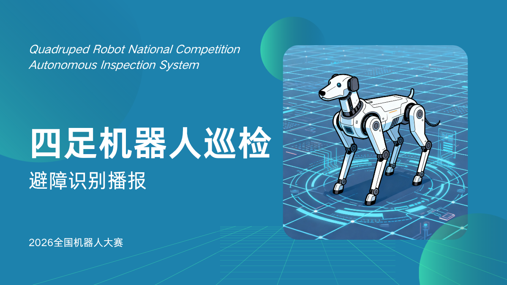
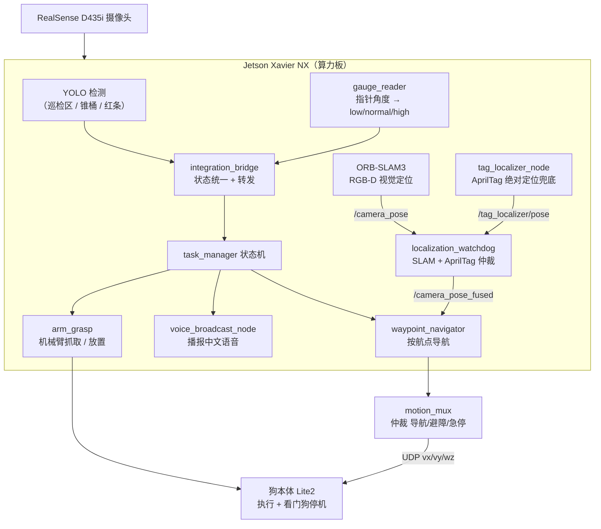
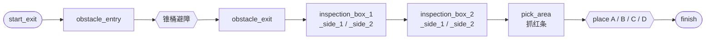

<p align="center">
  
</p>

<h1 align="center">四足机器人国赛自主巡检系统</h1>

<p align="center">
  绝影 Lite2 四足机器狗 + Jetson Xavier NX，在 2026 中国高校智能机器人创意大赛（四足大型组）国赛中的自主巡检方案
</p>

<p align="center">
  <a href="https://github.com/Nanako-Arasaka/dog/stargazers"></a>
  
  
  
  
  
</p>

> 一句话：让四足机器狗自己走完一条巡检路线——躲开锥桶、读仪表盘、用中文喊话、抓红色长条、再放进对应字母的箱子里。

---

## 目录

- [项目背景](#项目背景)
- [比赛任务与评分](#比赛任务与评分)
- [系统架构](#系统架构)
- [任务流程（FSM）](#任务流程fsm)
- [核心模块](#核心模块)
- [目录结构](#目录结构)
- [快速开始](#快速开始)
- [部署要点](#部署要点)
- [调试指令](#调试指令)
- [文档索引](#文档索引)
- [当前状态与待办](#当前状态与待办)
- [许可证](#许可证)

---

## 项目背景

这是为「2026 中国高校智能机器人创意大赛 · 四足大型组」国赛写的整套运行代码。比赛要求机器狗在 10 分钟内自主完成一条固定路线：**避障 → 巡检识别 → 抓取放置**，全程不能人为干预。

我们的架构思路很直接：把重活都放在 Jetson 算力板上，狗本体只负责两件最底层的事——接收速度指令、超时自己停机。YOLO 检测、OpenCV 读表、放置区识别、任务状态机、机械臂高层控制、SLAM 与路径决策，全在 Jetson（Xavier NX）上跑；狗端只跑一个轻量的运动接收程序和看门狗。

这样分工的好处是：狗端崩了不至于带着人跑，Jetson 端想怎么迭代算法都不用动狗。

## 比赛任务与评分

| 任务 | 分值 | 我们怎么拿 |
|---|---:|---|
| 锥形桶避障 | 10 | YOLO 检测 + 四级规则策略，8 Hz 下发速度指令 |
| 巡检识别（含语音播报） | 40 | 4 个巡检点读表，结果用中文语音播报（只播不喊直接少一半分） |
| 红色长条抓取放置 | 50 | 抓 2 次红条，按异常区域放进对应字母（A/B/C/D）的箱子 |

> 语音播报不是锦上添花——巡检那 40 分里，有播报和只终端打印是两档分。所以代码里专门做了 `voice_broadcast_node`，预生成了 12 路中文音频（A/B/C/D × 偏低/正常/偏高）。

## 系统架构



## 任务流程（FSM）

整条任务是一条状态机串起来的：进障碍区躲锥桶 → 4 个巡检点读表并播报 → 抓取区抓红条 → 按异常区域放到对应箱子 → 结束。



状态机的航点定义在 `jetson_payload/slam_maps/waypoints_FINAL.yaml`，需要到现场采集真实坐标后填入（见[当前状态与待办](#当前状态与待办)）。

## 核心模块

**1. 巡检识别（40 分）**
`main` 流程里 `live_detect_yolo_opencv.py` 用 YOLO 定位 5 类区域（zone_A/B/C/D + gauge），裁出仪表盘 ROI；`gauge_reader.py` 走经典 CV 管线读指针角度并判 `low/normal/high`：灰度 → 高斯模糊 → CLAHE → Canny → 霍夫圆 → 霍夫直线 → HSV 色带分类，每一级都有降级兜底。结果经 `integration_bridge` 冻结（每区 3 次一致）后发布。

**2. 语音播报（决定巡检那 40 分能不能拿满）**
`nodes/voice_broadcast_node.py` 订阅巡检结果，按 `A_低/正常/高` 等 12 种组合播放 `output/audio/` 下预生成的 wav。支持 `mock` / `aplay` / `ffplay` 三种引擎，现场用 `aplay` 驱动外置 USB 扬声器。

**3. 锥形桶避障（10 分）**
YOLO 检测锥桶（conf 0.35）→ 四级规则策略：紧急停车（面积 > 20%）→ 主动避障（中央区域或面积 > 8%）→ 微调偏航 → 全速前进（vx=0.16）。转向方向由左右锥桶加权面积比较决定，8 Hz 通过 UDP 下发狗端。

**4. 红条抓取（50 分）**
`arm_grasp/` 基于 JetArm 六自由度机械臂：HSV 双阈值红条检测 + RealSense 深度做 3D 位姿估计；几何法两连杆 IK；视觉闭环判定抓取成功（Δz > 3 cm），空抓按像素偏移定向重试。只有当放置区识别字母与异常目标一致时才松爪，防止误放。

**5. SLAM 导航与运动仲裁**
`controller/ORB_SLAM3/` 做 RGB-D 视觉定位，发布 `/camera_pose`；`waypoint_navigator` 按 FSM 顺序到达航点；`motion_mux` 仲裁导航/避障/急停速度；`lite2_motion_receiver.py` 把指令转成 Lite2 私有协议下发狗体（默认 `192.168.1.120:43893`），0.8 s 超时自动停机。

**6. AprilTag 兜底定位（新增，抗定位丢失）**
纯视觉 SLAM 在白墙/强光/抖动下会丢失定位，一旦丢失即本轮判死。为此加了 AprilTag 绝对定位兜底：`tag_localizer_node` 用官方 apriltag 库（tag36h11）检测贴在场地关键位置的 tag，反推相机世界位姿；`localization_watchdog` 改为**双源仲裁**——SLAM 主源 + AprilTag 兜底，输出融合位姿 `/camera_pose_fused`（navigator 订阅它）。SLAM 丢失时自动切到 tag 源继续跑，SLAM 恢复后迟滞切回，双源全丢才判故障。tag 世界坐标用 `tools/calibrate_tags.py` 现场标定（`--verify` 验证 ≤10cm/5°），打印码用 `tools/generate_apriltags.py` 生成（标准 AprilTag 极性，官方库可直接检测）。

## 目录结构

```text
国赛/
├── launch/guosai_final.launch.py   # 一键启动编排（ROS2 launch）
├── nodes/                          # 业务节点
│   ├── voice_broadcast_node.py     #   语音播报（12 路中文音频）
│   ├── waypoint_navigator.py       #   航点顺序导航（订阅融合位姿）
│   ├── motion_mux.py               #   运动指令仲裁（导航/避障/急停）
│   ├── cone_avoidance_node.py      #   锥桶避障
│   ├── localization_watchdog.py     #   定位看门狗（SLAM + AprilTag 双源仲裁）
│   └── tag_localizer_node.py        #   AprilTag 绝对定位兜底
├── scripts/                        # 现场脚本（采集/预检/运行）
├── tools/                          # 工具
│   ├── calibrate_tags.py           #   AprilTag 世界坐标现场标定 / 验证
│   └── generate_apriltags.py       #   生成 tag36h11 打印码（标准极性）
├── config/guosai_final.yaml        # 运行配置（SLAM/相机/导航/避障/巡检/机械臂/语音/FSM/tag）
├── config/tags.yaml                # AprilTag 定位点配置（10 个 tag 的世界位姿）
├── jetson_payload/                 # Jetson 部署包（FINAL SLAM 地图 + 上传脚本）
├── live_detect_yolo_opencv.py      # 主线实时巡检：YOLO 定位 + OpenCV 读表
├── gauge_reader.py                 # 仪表盘指针角度读取（多层降级）
├── camera_input.py                 # 多输入源统一取流封装（mock/video/camera）
├── arm_grasp/                      # JetArm 六自由度机械臂 ROS2 包
├── cone_avoidance/                 # 锥桶 YOLO 检测 + 策略
├── controller/                     # Lite2 运动接收、ORB-SLAM3、goal_controller
├── integration_bridge/             # 状态转发层
├── output/audio/                   # 12 路中文语音播报（A/B/C/D × 偏低/正常/偏高）
├── output/apriltags/               # AprilTag 打印码（10 个 PNG + A4 拼版 PDF）
└── docs/                           # 技术文档 / HANDOFF / 现场清单 / 视频脚本 / 场地布局
```

## 快速开始

### 环境

- Jetson Xavier NX，Ubuntu 22.04，Python 3.10，OpenCV
- YOLO：`PyTorch` + `Ultralytics`
- ROS2 Humble（机械臂、状态转发、导航联调）
- `*.osa`（SLAM 地图）走 Git LFS，clone 后记得 `git lfs pull`

```bash
cd 国赛
python3 -m pip install -r requirements.txt
source /opt/ros/humble/setup.bash
git lfs pull
```

### 一键启动（现场推荐）

```bash
bash scripts/guosai_onekey.sh     # 采集航点 → 预检 → 正式运行
bash scripts/run_guosai_final.sh  # 直接运行正式流程
```

### ROS2 统一启动

```bash
source /opt/ros/humble/setup.bash
export GUOSAI_ROOT=$(pwd)
ros2 launch launch/guosai_final.launch.py
```

## 部署要点

| 项 | 说明 |
|---|---|
| SLAM 地图 | `jetson_payload/slam_maps/guosai_rgbd_map_FINAL.osa`（322 MB），由 `config/guosai_final.yaml` 的 `slam.map_path` 指定 |
| ORB 词汇 | `scripts/preflight_guosai_final.py` 优先用仓库内路径，缺失时回退 `/home/jetson/ORB_SLAM3/Vocabulary/ORBvoc.txt`（139 MB，不入库） |
| 机械臂消息包 | `ros_robot_controller_msgs` 手动 cmake install 到 `arm_grasp/install/`；启动脚本已内置 `AMENT_PREFIX_PATH` / `PYTHONPATH` 注册 |
| 语音引擎 | 现场把 `voice_broadcast.engine` 改为 `aplay` + `device: plughw:X,0`（外置 USB 扬声器）；空 device 已有兜底，不会因参数解析报错 |
| AprilTag 兜底定位 | 现场需 `apt install libapriltag-dev` + `pip install apriltag`（JetPack 5 自带 OpenCV 4.5 无 AprilTag 字典，降级后端不可用）；贴好 10 个 tag 后用 `tools/calibrate_tags.py` 标定 → `--verify` 通过后把 `tag_localizer.enabled` 置 true |

> ⚠️ **已知配置坑**：`config/guosai_final.yaml` 里的 `slam.map_path` 目前仍指向旧的 `guosai_rgbd_map_v4.osa`，正式部署前需改成 `jetson_payload/slam_maps/guosai_rgbd_map_FINAL.osa`。

### 狗本体

只跑轻量的运动接收程序（`controller/lite2_motion_receiver.py`）和看门狗，**不建议**在狗端跑 YOLO / OpenCV 读表 / ORB-SLAM3 / 任务状态机。

## 调试指令

```bash
# 查看任务状态
ros2 topic echo /competition/state

# 重置巡检冻结
ros2 topic pub --once /inspection/reset std_msgs/msg/Bool "data: true"

# 手动注入巡检结果（A 异常 / B 正常 / C 异常 / D 正常）
ros2 topic pub --once /bridge/inspection_result std_msgs/msg/String \
  "data: 'A:abnormal,B:normal,C:abnormal,D:normal'"

# 触发抓红条
ros2 topic pub --once /task/direct_grasp std_msgs/msg/String "data: 'red'"

# 查看 AprilTag 兜底定位状态（检测到哪个 tag / 融合位姿源）
ros2 topic echo /tag_localizer/status
ros2 topic echo /tag_localizer/seen_tags
ros2 topic echo /localization/status

# 生成 / 重标定 AprilTag 打印码
python3 tools/generate_apriltags.py --ids 1,2,3 --size-cm 20
python3 tools/calibrate_tags.py --tags-yaml config/tags.yaml
python3 tools/calibrate_tags.py --tags-yaml config/tags.yaml --verify
python3 tools/calibrate_tags.py --self-test
```

分终端启动（调试用）的完整命令见 `docs/技术文档_草稿.md` 与 `jetson_payload/JETSON_RUN_COMMANDS.md`。

## 文档索引

| 文档 | 位置 |
|---|---|
| 国赛技术文档草稿（评审用） | `docs/技术文档_草稿.md` |
| Jetson 现场执行清单 | `docs/Jetson_现场执行清单.md` |
| 接手指南（HANDOFF） | `docs/接手指南_HANDOFF.md` |
| 线上视频拍摄脚本 | `docs/线上视频_拍摄脚本.md` |
| 机械臂跑通流程 | `arm_grasp/JetArm_跑通流程.md` |
| 运动控制运行流程 | `controller/Lite2正式运行流程.txt` |
| Jetson 部署命令 | `jetson_payload/JETSON_RUN_COMMANDS.md` |
| 场地布局与 10 点定位地图 | `docs/场地布局_10点定位地图.md` |

## 当前状态与待办

**已跑通（2026-08-12，Jetson 真机 dry-run）**：FSM 13 态端到端走完，5 个节点全部启动；preflight 代码类检查全部通过。剩下的都是现场动作：

- [ ] **航点采集**：`jetson_payload/slam_maps/waypoints_FINAL.yaml` 里坐标目前全是 `0.0`，必须现场 `bash scripts/guosai_onekey.sh collect` 采集真实航点后填入
- [ ] **语音配置**：现场把 `voice_broadcast.engine` 设为 `aplay` 并指定 `device`
- [ ] **地图路径**：把 `config/guosai_final.yaml` 的 `slam.map_path` 从旧 `v4.osa` 改为 `FINAL.osa`（见[部署要点](#部署要点)）
- [ ] **AprilTag 标定**：贴好 10 个 tag 后，现场 `python3 tools/calibrate_tags.py --tags-yaml config/tags.yaml` 标定 → `--verify` 验证 → 把 `tag_localizer.enabled` 置 true（标定前保持 false 不误启用）

## 许可证

本仓库暂未添加 LICENSE 文件。如需在教学、二次开发中使用或引用，请先联系作者。

---

<p align="center">
  绝影 Lite2 · Jetson Xavier NX · ROS2 Humble · YOLO + OpenCV + ORB-SLAM3
</p>
