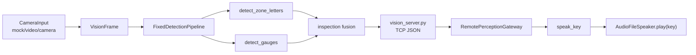

# 巡检识别闭环架构

本项目当前只保留国赛巡检识别模块。算力板负责相机取流和视觉结果输出，机器狗本地只通过 `RemotePerceptionGateway` 接收结构化 JSON；语音模块只根据 `speak_key` 播放预生成音频。

已删除范围：Mission 任务编排、避障、导航、DogController、机械臂抓取/搬运/放置、掉落处理、红条抓取、锥桶检测、SLAM 或路径规划相关代码。

## 模块边界

| 模块 | 职责 |
| --- | --- |
| `camera_input.py` | 从 mock / video / camera 读取帧，输出统一 `VisionFrame` |
| `src/perception/detector/fixed_detector.py` | 区域字母识别、仪表盘识别、巡检融合 |
| `vision_server.py` | 算力板 TCP JSON 服务，每次请求读取一帧并返回检测结果 |
| `src/perception/remote_gateway.py` | 机器狗本地远端感知网关，解析巡检 JSON |
| `src/hardware/speaker/interface.py` | `AudioFileSpeaker.play(key)` 播放 `A_low.wav` 等音频 |
| `config/robot_config.json` | 相机、远端感知、字母、仪表、巡检和音频配置 |

## 数据流



## TCP 协议

保留请求：

```json
{"req": "detect_zone_letters"}
{"req": "detect_gauges"}
{"req": "poll_inspection"}
```

响应示例：

```json
{
  "type": "inspection_results",
  "results": [
    {
      "zone": "A",
      "gauge_status": "low",
      "status": "low",
      "abnormal": true,
      "confidence": 0.82,
      "letter_bbox": {"x1": 20, "y1": 20, "x2": 80, "y2": 120},
      "gauge_bbox": {"x1": 240, "y1": 120, "x2": 420, "y2": 300},
      "speak_key": "A_low",
      "timestamp": 123.456
    }
  ],
  "detections": [],
  "timestamp": 123.456
}
```

## VisionFrame

`CameraInput.read()` 输出统一帧对象：

- `frame_id`
- `timestamp`
- `image`
- `width`
- `height`
- `source_type`

输入源：

- `--mode mock`
- `--mode video --source xxx.mp4`
- `--mode camera --source 0`

预处理保留：

- resize 到配置尺寸
- 可选水平翻转
- ROI 配置预留
- debug frame 定期保存

## 检测层

`FixedDetectionPipeline` 当前只处理：

- `detect_zone_letters(frame)`
- `detect_gauges(frame)`
- `poll_inspection(frame)`

字母识别：

- 灰度化
- 二值化 / 自适应阈值
- 轮廓检测
- ROI 裁剪
- A/B/C/D 模板匹配
- 模板缺失时自动生成到 `assets/templates/letters/`

仪表盘识别：

- 灰度化和模糊降噪
- HoughCircles 或亮色区域定位表盘
- ROI 裁剪
- Canny + HoughLinesP 或 numpy fallback 检测指针
- 计算指针角度
- 根据可配置角度阈值输出 `low/normal/high`

巡检融合：

- 过滤低置信度字母和仪表
- 优先按 bbox 空间距离匹配
- 空间匹配失败时按顺序匹配
- 生成 `InspectionResult` 和 `speak_key`

## Debug 输出

- `output/debug_frames/`
- `output/debug_letters/`
- `output/debug_gauge/`
- `output/debug_inspection/`

## 保留测试

- `tests/unit/test_fixed_detector.py`
- `tests/unit/test_audio_file_speaker.py`
- `tools/test_camera_input.py`
- `tools/test_remote_perception_client.py`
- `tools/test_speaker_playback.py`

## 运行命令

```powershell
python .\vision_server.py --mode mock --host 0.0.0.0 --port 9800
python .\tools\test_remote_perception_client.py
python .\tools\test_camera_input.py
python .\tools\test_speaker_playback.py --save-playback-log
python -m pytest -q
```
