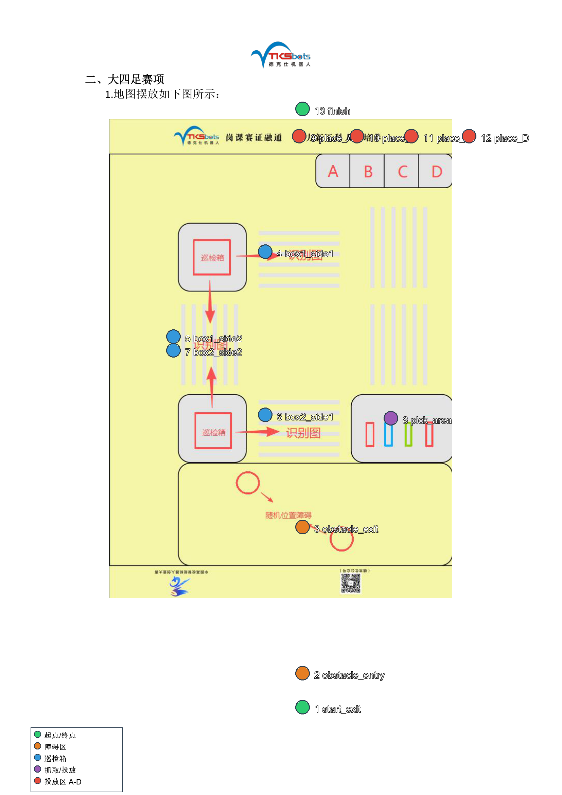

# 机器狗航点可用性分析报告

## 一、结论摘要

| 维度 | 结论 |
|---|---|
| **航点完整性** | ✅ 13 个 FSM 必需航点全部存在，名字全部命中 `config/guosai_final.yaml` 的 `fsm` 段。 |
| **零值检查** | ✅ 所有航点均已填入非零真实位姿，不再是占位 `0,0,0`。 |
| **坐标系一致性** | ⚠️ 真实航点与 `cone_avoidance/competition_map.yaml` 中的障碍区配置**不在同一坐标系/尺度**上，必须修正。 |
| **几何合理性** | ⚠️ 整体可跑，但 `finish` 离投放区过远（6.52 m），`start_exit` 与 `obstacle_entry` 几乎重合，建议复核。 |
| **比赛地图对应** | ✅ 每个航点都能按功能对应到 PDF 第 2 页“大四足赛项”的明确区域（见下图与表格）。 |

**总体判断：当前航点名字与位姿数据本身可用，但在真正上场比赛前必须先修复 `competition_map.yaml`，否则锥桶避让阶段会跑飞。**

---

## 二、每个航点在比赛地图中的位置



| 编号 | 航点名称 | 比赛地图中的区域 | 说明 |
|---|---|---|---|
| 1 | `start_exit` | 出发区（障碍区下方） | 起点离开后的第一个目标 |
| 2 | `obstacle_entry` | 随机位置障碍区入口 | 进入锥桶/圆形障碍区，FSM 在此开启避让 |
| 3 | `obstacle_exit` | 随机位置障碍区出口 | 离开障碍区，FSM 在此关闭避让 |
| 4 | `inspection_box_1_side_1` | 上方巡检箱右侧识别图 | 第一个巡检箱的第一侧识别位 |
| 5 | `inspection_box_1_side_2` | 上方巡检箱下方识别图 | 两个巡检箱之间的竖直识别带 |
| 6 | `inspection_box_2_side_1` | 下方巡检箱右侧识别图 | 第二个巡检箱的第一侧识别位 |
| 7 | `inspection_box_2_side_2` | 下方巡检箱上方识别图 | 两个巡检箱之间的竖直识别带 |
| 8 | `pick_area` | 彩色柱状抓取区 | 机械臂取红色/蓝色/绿色柱状物 |
| 9 | `place_A` | 顶部 A 投放区 | 仅当 A 检测为异常时进入 |
| 10 | `place_B` | 顶部 B 投放区 | 仅当 B 检测为异常时进入 |
| 11 | `place_C` | 顶部 C 投放区 | 仅当 C 检测为异常时进入 |
| 12 | `place_D` | 顶部 D 投放区 | 仅当 D 检测为异常时进入 |
| 13 | `finish` | 终点区 | 任务完成后的终点（见下文复核建议） |

---

## 三、航点数值与相邻距离

### 3.1 航点坐标

| 航点 | x (m) | y (m) | yaw (rad) | 备注 |
|---|---:|---:|---:|---|
| `start_exit` | -0.038 | 0.001 | -0.000 | 接近原点 |
| `obstacle_entry` | -0.056 | -0.016 | 0.006 | 与起点几乎重合 |
| `obstacle_exit` | 0.740 | 0.174 | -0.036 | 障碍区出口 |
| `inspection_box_1_side_1` | 0.146 | -0.042 | -3.127 | 上箱右侧 |
| `inspection_box_1_side_2` | -0.759 | 0.029 | -1.762 | 上箱下方/两箱之间 |
| `inspection_box_2_side_1` | -0.006 | -0.027 | 0.016 | 下箱右侧 |
| `inspection_box_2_side_2` | -0.866 | -0.061 | -2.237 | 下箱上方/两箱之间 |
| `pick_area` | -3.418 | 0.002 | 0.008 | 抓取区 |
| `place_A` | -2.216 | -0.114 | 3.123 | 投放 A |
| `place_B` | -2.761 | -0.105 | 3.121 | 投放 B |
| `place_C` | -3.253 | -0.100 | 3.118 | 投放 C |
| `place_D` | -3.796 | -0.094 | 3.122 | 投放 D |
| `finish` | 2.728 | -0.014 | 0.012 | 终点 |

### 3.2 场地跨度

- **x 跨度**：`-3.796 m ~ +2.728 m`，总宽度 **6.524 m**
- **y 跨度**：`-0.114 m ~ +0.174 m`，总深度 **0.288 m**

所有航点的 `y` 都集中在 ±0.2 m 以内，说明当前路径在 SLAM 地图帧中近似一条沿 x 轴的直线。如果赛场实际布局在 PDF 中是“竖长”的，那说明 SLAM 坐标系的 x 轴与 PDF 的竖直方向对齐，y 轴与 PDF 的水平方向对齐。

### 3.3 FSM 顺序下的相邻距离

| 路径段 | 距离 |
|---|---:|
| `start_exit` → `obstacle_entry` | **0.025 m** |
| `obstacle_entry` → `obstacle_exit` | **0.819 m** |
| `obstacle_exit` → `inspection_box_1_side_1` | 0.632 m |
| `inspection_box_1_side_1` → `inspection_box_1_side_2` | 0.909 m |
| `inspection_box_1_side_2` → `inspection_box_2_side_1` | 0.755 m |
| `inspection_box_2_side_1` → `inspection_box_2_side_2` | 0.860 m |
| `inspection_box_2_side_2` → `pick_area` | 2.553 m |
| `pick_area` → `place_A` | 1.208 m |
| `place_A` → `place_B` | 0.546 m |
| `place_B` → `place_C` | 0.491 m |
| `place_C` → `place_D` | 0.543 m |
| `place_D` → `finish` | **6.524 m** |

---

## 四、关键风险：`competition_map.yaml` 与真实航点坐标系不一致

### 4.1 当前配置

`cone_avoidance/competition_map.yaml` 当前写死：

```json
{
  "obstacle_zone_rect": { "xmin": 0.0, "xmax": 6.0, "ymin": -1.5, "ymax": 1.5 },
  "global_path": [ [0.2, 0.0], [5.8, 0.0] ]
}
```

它假设障碍区是一条 **6 m 长、沿 +x 方向** 的走廊。

### 4.2 真实航点揭示的障碍区

真实采集到的障碍区起止：

- `obstacle_entry`: `(-0.056, -0.016)`
- `obstacle_exit`: `(0.740, 0.174)`

真实障碍区：
- 长度仅约 **0.82 m**
- 位于 SLAM 地图原点附近，x ∈ [-0.1, 0.8]
- 与配置里的 `x ∈ [0, 6]`、global_path `[0.2,0]→[5.8,0]` 完全错位

### 4.3 会导致什么问题

`task_manager_node.py` 的状态机：

```text
GO_OBSTACLE_ENTRY → arrived:obstacle_entry
  → 发布 /motion/enable_cone_avoidance = True
  → 进入 OBSTACLE_ZONE，目标 obstacle_exit
```

在 `OBSTACLE_ZONE` 期间，`motion_mux` 会优先采用 `cone_avoidance/local_planner.py` 输出的速度。local_planner 会根据 `competition_map.yaml` 的 `global_path` 规划一条沿 +x 到 `x=5.8` 的直线，并沿该直线做锥桶避让。

但实际障碍区只到 `x≈0.74`，且真实 `obstacle_exit` 在 `(0.740, 0.174)`。结果：

1. 机器狗会被引导向 `x=5.8` 前进，远超真实场地（整个场地 x 最大才 2.728）。
2. 状态机要等 `/waypoint/status` 报 `arrived:obstacle_exit` 才会退出 `OBSTACLE_ZONE`；如果避让行为把狗带偏，可能迟迟收不到到达信号，导致**卡在 OBSTACLE_ZONE**。
3. 即使后续强行退出，狗也已经离开比赛区域。

### 4.4 修复建议

在确认真实坐标系后，把 `competition_map.yaml` 改成与真实航点对齐，例如：

```json
{
  "obstacle_zone_rect": {
    "xmin": -0.2,
    "xmax": 1.0,
    "ymin": -0.5,
    "ymax": 0.5
  },
  "global_path": [
    [-0.056, -0.016],
    [0.740, 0.174]
  ]
}
```

> 上面的值只是按你当前航点的 entry/exit 给出；如果你现场重新采集，请以新的 entry/exit 为准。

---

## 五、其他待复核项

1. **`start_exit` 与 `obstacle_entry` 几乎重合（0.025 m）**
   - 如果出发区就在障碍区入口旁边，这是正常的。
   - 如果两者本应有一段距离，建议重新采集或合并为一个点。

2. **`finish` 离 `place_D` 达 6.52 m**
   - 这是所有相邻段中最长的一段，几乎横跨整个场地。
   - 请确认终点确实在投放区对面；如果终点应在出发区附近，则 `finish` 坐标可能需要调整到 `x≈0` 附近。

3. **所有航点 y 接近 0**
   - 说明当前路径近似一条直线。请确认这是否符合实际赛场：如果赛场需要横向移动（比如从巡检箱到抓取区需要横向走位），但 y 坐标没有变化，可能漏采了横向接近点。

---

## 六、下一步建议

| 优先级 | 动作 | 目的 |
|---|---|---|
| 🔴 高 | 修正 `cone_avoidance/competition_map.yaml` 的 `global_path` 与 `obstacle_zone_rect` | 保证锥桶避让段不跑飞 |
| 🟡 中 | 复核 `start_exit` / `obstacle_entry` 是否需分开 | 避免状态机瞬间跳变 |
| 🟡 中 | 复核 `finish` 坐标 | 避免最后一段长距离折返 |
| 🟢 低 | 用 `dry_run:=true` 跑一次 `launch/guosai_final.launch.py` | 验证 FSM 状态流转无报错 |
| 🟢 低 | 实地低速跑 OBSTACLE_ZONE，观察是否沿真实障碍区前进 | 真实环境验证 |

---

*分析时间：2026-08-14*  
*数据来源：`jetson_payload/slam_maps/waypoints_FINAL.yaml`、`cone_avoidance/competition_map.yaml`、`/Users/silencecf/Downloads/2026（6.24）高校智能机器人创意大赛规则说明.pdf`*
